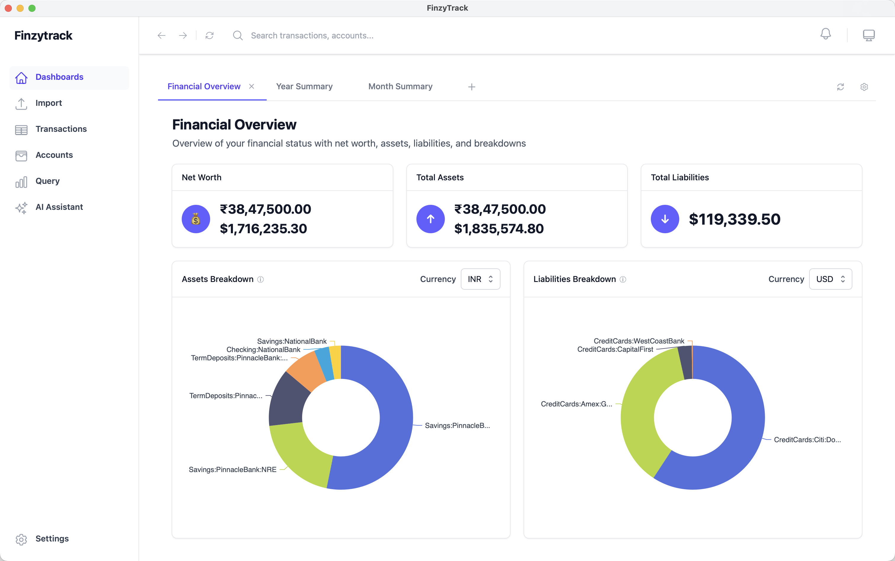
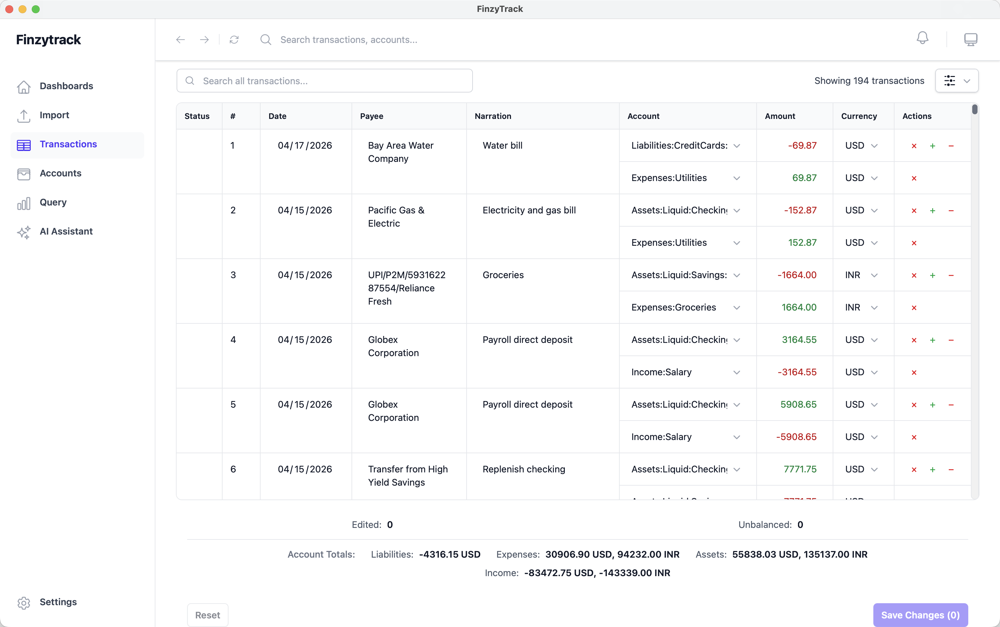

# Finzytrack

Open-source personal finance software for people who want to understand their finances without giving up privacy or control. Built on [Beancount](https://beancount.github.io/) double-entry bookkeeping — your data lives in a plain-text ledger file on your machine, readable by any text editor, with no lock-in. AI is entirely optional and works with any model you choose.

<picture>
  <source media="(prefers-color-scheme: dark)" srcset="screenshots/financial-overview-dashboard-dark.png">
  
</picture>

<picture>
  <source media="(prefers-color-scheme: dark)" srcset="screenshots/transactions-dark.png">
  
</picture>

## Features

- **Double-entry bookkeeping** — built on Beancount, the powerful plain-text accounting system
- **Import a wide variety of statements** — rule-based importers for OFX, CSV, XLS files, PDF statements, or directly from email
- **Find any transaction, instantly** — global search across your full history, with advanced filtering by date, amount, account, and more
- **Customizable dashboards** — KPI cards, charts, tables, and pivot tables in configurable grid layouts
- **Auto-categorization** — train on your past transactions or use AI assistance
- **Powerful querying** — SQL and BQL queries against your financial data
- **Optional AI assistance** — parse statements, create import rules, enter transactions in natural language, build dashboards, and answer financial questions
- **You own your data** — everything stored in a single plain-text Beancount ledger file with zero lock-in

## Documentation

Full documentation at [docs.finzytrack.com](https://docs.finzytrack.com), including:

- [Quick Start](https://docs.finzytrack.com/quick-start/) — get up and running from first launch
- [Installation](https://docs.finzytrack.com/installation/) — download and install on macOS (Apple Silicon), Linux, or Windows
- [Views](https://docs.finzytrack.com/views/) — guide to each screen in the app
- [Reference](https://docs.finzytrack.com/reference/) — technical reference for recipes, rules, queries, and configuration

## Development Setup

See [Building from Source](https://docs.finzytrack.com/development/building/) for full development instructions. But here's a quickstart — first, install the [platform-specific prerequisites](https://docs.finzytrack.com/development/building/#platform-specific-prerequisites) for your platform (on Linux, without them `pip install` will fail building PyGObject). Then:

```bash
git clone git@github.com:sagarbehere/finzytrack.git
cd finzytrack

# Backend
python3 -m venv venv
source venv/bin/activate
cd backend
pip install -r requirements.txt

# Frontend
cd ../frontend
npm install
```

## Contributing

Bug reports and feature requests are very welcome — please open a GitHub issue and I'll do my best to address them.

**I'm not currently accepting pull requests.** This is a personal side project, and I can't commit to the kind of timely, thoughtful code review that contributors deserve. I'd rather be upfront about that than leave patches sitting unreviewed for weeks. If you've found a bug or have an idea, please open an issue and I'll pick it up when I can.

## License

This project is licensed under the [GNU General Public License v2.0](LICENSE).
